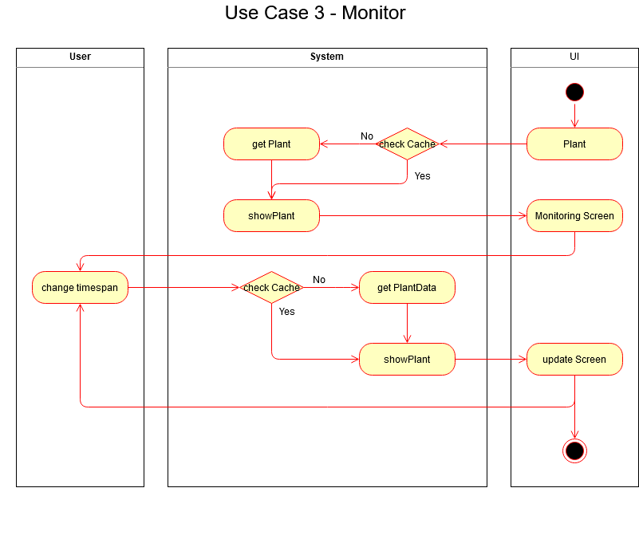

# Software Architecture Document

## 1. Introduction 
### 1.1 Purpose
This document provides a comprehensive architectural overview of the system, 
using a number of different architectural views to depict different aspects of the system. 
It is intended to capture and convey the significant architectural decisions which have been made on the system.

### 1.2 Scope
The scope of this SAD is to show the architecture of the project. Affected are the class structure, the use cases and the data representation.

### 1.3 References
- [GitHub](https://github.com/jdk-21/lazyplants)
- [Blog](https://lazysmartplants.wordpress.com/)
- [WIKI](https://github.com/Kokoloris19097/LazyPlants.dokumentation)
- [Software Requirements Specification](SRS.md)

## 2. Architectural Representation

## 3.Architectural Goals and Constraints 

## 4. Use-Case View 
### Overview

### UC: Add Plant

### UC: Water Plant

### UC: Measure

### UC: Sync Settings and Data

### UC: Monitoring

### UC: Live Dashboard

## 5. Logical View

## 6. Process View

## 7. Deployment View

## 8. Implementation View

## 9. Data View

## 10. Size and Performance

## 11. Quality
For this project we are using the MVC pattern. It helps us to maintain a stable codebase. Additionaly we are using Continous Integration for testing. Every pull request gets peer reviewed to ensure the best code quality possible. 
We also use metrics (dart_metrics) to get a better understanding of our code complexity etc.
