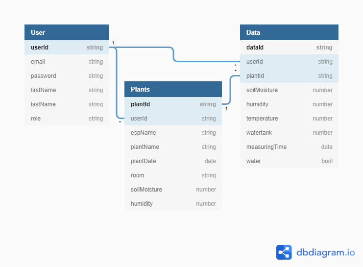

Project - LazyPlants | Software Requirements Specification
======

- [Project - LazyPlants | Software Requirements Specification](#project---lazyplants--software-requirements-specification)
  - [1. Introduction](#1-introduction)
    - [1.1 Purpose](#11-purpose)
    - [1.2 Scope](#12-scope)
    - [1.3 Definitions, Acronyms and Abbreviations](#13-definitions-acronyms-and-abbreviations)
    - [1.4 References](#14-references)
    - [1.5 Overview](#15-overview)
  - [2. Overall Description](#2-overall-description)
    - [2.1 Vision](#21-vision)
    - [2.2 Use Case Diagram](#22-use-case-diagram)
    - [2.3 Technology Stack](#23-technology-stack)
  - [3. Specific Requirements](#3-specific-requirements)
    - [3.1 Functionality](#31-functionality)
      - [3.1.1 Add Plant](#311-add-plant)
      - [3.1.2 Water Plants](#312-water-plants)
      - [3.1.3 Sync Settings and Data](#313-sync-settings-and-data)
  - [3.2 Usability](#32-usability)
    - [3.2.1 Usability Requirement One](#321-usability-requirement-one)
  - [3.3 Reliability](#33-reliability)
    - [3.3.1 Reliability Requirement One](#331-reliability-requirement-one)
  - [3.4 Perfomance](#34-perfomance)
    - [3.4.1 Performance Requirement One](#341-performance-requirement-one)
    - [3.5 Supportability](#35-supportability)
      - [3.5.1 Supportability Requirement One](#351-supportability-requirement-one)
    - [3.6 Design Constraints](#36-design-constraints)
      - [3.6.1 Design](#361-Design)
      - [3.6.2 Database](#362-Database)
      - [3.6.3 Language](#363-Language)
      - [3.6.4 Architecture](#364-Architecture)
    - [3.7 On-line User Documentation and Help System Requirements](#37-on-line-user-documentation-and-help-system-requirements)
    - [3.8 Purchased Components](#38-purchased-components)
    - [3.9 Interfaces](#39-interfaces)
      - [3.9.1 User Interfaces](#391-user-interfaces)
      - [3.9.2 Hardware Interfaces](#392-hardware-interfaces)
      - [3.9.3 Software Interfaces](#393-software-interfaces)
      - [3.9.4 Communications Interfaces](#394-communications-interfaces)
    - [3.10 Licensing Requirements](#310-licensing-requirements)
    - [3.11 Legal, Copyright, and Other Notices](#311-legal-copyright-and-other-notices)
    - [3.12 Applicable Standards](#312-applicable-standards)
  - [4. Supporting Information](#4-supporting-information)

# Revision History
-----

| Date       | Version | Description    |
| ---------- | ------- | -------------- |
| 15.10.2020 | 1.0     | topic 1-2      |
| 28.10.2020 | 1.1     | new UCs in 3.1 | 

## 1. Introduction
### 1.1 Purpose
This Software Requirements Specification was created to collect and organize the requirements for the LazyPlant application. It contains a thorough description of the expected functionality for the project and non-functional requirements. These are critical to the understanding between the hardware and software. The document will also form the basis for cost estimation and subsequent validation of the results obtained.

### 1.2 Scope
Our goal for this semester is to connect all hardware so that data can be exchanged. The sensors should forward measuring results to the app and these results should be stored in a local database.

### 1.3 Definitions, Acronyms and Abbreviations
| Abbrevation | Explanation                            |
| ----------- | -------------------------------------- |
| SRS         | Software Requirements Specification    |
| n/a         | not applicable                         |
| tbd         | to be determined                       |
| UCD         | Use Case Diagram                       |
| UC          | Use Case                               |
| Flutter     | Flutter is Google’s UI toolkit for building beautiful, natively compiled applications for mobile, web, and desktop from a single codebase. |
| ----------- | -------------------------------------- |

### 1.4 References

| Title                                                                           | Date       | Publishing organization   |
| --------------------------------------------------------------------------------|:----------:| ------------------------- |
| [Use Case Diagram LazyPlants](https://lazysmartplants.files.wordpress.com/2020/10/untitled-diagram-2.png?w=1024)| 15.10.2020 | LazyPlants |
| [Activity Diagram Add Plant](https://lazysmartplants.files.wordpress.com/2020/10/use-case-1-2.png)| 28.10.2020 | LazyPlants |
| [Activity Diagram Water Plants](https://lazysmartplants.files.wordpress.com/2020/10/use-case-12.png)| 28.10.2020 | LazyPlants |
| [Activity Diagram Dashboard](https://raw.githubusercontent.com/Kokoloris19097/LazyPlants.dokumentation/master/UC/Use%20Case%205%20-%20Dashboard.jpg)| 20.04.2020 | LazyPlants |
| --------------------------------------------------------------------------------|:----------:| ------------------------- |

### 1.5 Overview
This section gives a quick overiew overview of the SRS: In the next chapter, the Overall Description section, an overview of the functionality of the product and an use-case-diagram is given. The third chapter, the Requirements Specification section, provides an more detailed description of the requirements in chapter 3.1. Further requirements like usability, reliability and supportability are listed in chapters 3.2 through 3.12. Chapter four contains supporting information.

## 2. Overall Description
### 2.1 Vision
Our vision is to create an automatic plant watering system for all those that cant keep their plants alive because they’re too lazy to water them. With "LazyPlants" we want to save those sad, dried out plants. To give them back the joy of life, we want to develop a cost-effective solution. The plants should be optimally monitored and supplied by microcontrollers and sensors.

### 2.2 Use Case Diagram

### 2.3 Technology Stack
The technologies we use are:

RestApi:
- LoopBack4
- MongoDB Database

Frontend:
- Flutter
- Dart

IDE:
- VS Code
- IntelliJ
- Arduino IDE

Project Management:

- Jira
- YouTrack
- GitHub

Deployment:
- Github Actions
- Docker

Quality:
- ...

Testing:
- Flutter
- Postman

## 3. Specific Requirements
This section will list all functional requirements for "LazyPlants" and explains their functionality. Each of the following subsections represents a subsystem of our app.

### 3.1 Functionality
#### 3.1.1 Add Plant
Every user can add their plants that they want to either get watered automatically or get a reminder to water them. First step is to register the ESP, after that the user needs to type in a name for it’s new plant. When adding the ESP and name happend, they can also insert a picture of the added plant. [UC: Add Plant](./UC/uc-add-plant.md)

#### 3.1.2 Water Plants
The user can start the watering mechanism manually. When the moisture of the plant is low, the app shows you that the plant needs water and that you can water them. When there is enough moisture, you can't water your plant. This pervents that the user overwaters their plants.
[UC: Water Plants](./UC/uc-water-plants.md)
	
#### 3.1.3 Sync Settings and Data
Every user should be able to access his/her data on every supported device. Therefore settings data and plants data should be accessible via the backend. That's how we want to assure a seemless user experience.
[UC: Sync Settings](./UC/uc-sync-settings.md)

### 3.2 Usability
[This section should include all of those requirements that affect usability. For example,
 - specify the required training time for a normal users and a power user to become productive at particular operations
 - specify measurable task times for typical tasks or base the new system�s usability requirements on other systems that the users know and like
 - specify requirement to conform to common usability standards, such as IBM�s CUA standards Microsoft�s GUI standards]

#### 3.2.1 Usability Requirement One
[The requirement description goes here.]

### 3.3 Reliability
[Requirements for reliability of the system should be specified here. Some suggestions follow:
 - Availability�specify the percentage of time available ( xx.xx%), hours of use, maintenance access, degraded mode operations, etc.
 - Mean Time Between Failures (MTBF) � this is usually specified in hours, but it could also be specified in terms of days, months or years.
 -  Mean Time To Repair (MTTR)�how long is the system allowed to be out of operation after it has failed?
 - Accuracy�specify precision (resolution) and accuracy (by some known standard) that is required in the system�s output.
 - Maximum Bugs or Defect Rate�usually expressed in terms of bugs per thousand of lines of code (bugs/KLOC) or bugs per function-point( bugs/function-point).
 - Bugs or Defect Rate�categorized in terms of minor, significant, and critical bugs: the requirement(s) must define what is meant by a �critical� bug; for example, complete 
   loss of data or a complete inability to use certain parts of the system�s functionality.]

#### 3.3.1 Reliability Requirement One
[The requirement description.]

### 3.4 Perfomance
[The system�s performance characteristics should be outlined in this section. Include specific response times. Where applicable, reference related Use Cases by name.
 - response time for a transaction (average, maximum)
 - throughput, for example, transactions per second
 - capacity, for example, the number of customers or transactions the system can accommodate
 - degradation modes (what is the acceptable mode of operation when the system has been degraded in some manner)
 - resource utilization, such as memory, disk, communications, etc.

#### 3.4.1 Performance Requirement One
[The requirement description goes here.]

### 3.5 Supportability
[This section indicates any requirements that will enhance the supportability or maintainability of the system being built, including coding standards, naming conventions, 
class libraries, maintenance access, maintenance utilities.]

#### 3.5.1 Supportability Requirement One
[The requirement description goes here.]

### 3.6 Design Constraints
#### 3.6.1 Design

The app design will follow a simple but modern structure. In order to achieve an individual and optimal look, connected to a comfortable use, we will offer a lot of possibilities to enhance the user experience. The user should be able to  individualize his settings, get insights with the help of diagrams and get notified when for example the user has to refill the watertank.

#### 3.6.2 Database

As we use Loopback as our backend service of choice, we have the opportunity to choose any of the major databases. However we finally chose MySQL to structure and store our data.

#### 3.6.3 Language

The project consists of multiple services that run on different platforms. For our backend service, we are using Loopback 4, which uses TypeScript. The software for MCUs is written in C++ (Arduino), because it's the most widely used language for MCUs.
Finally we use Google's UI toolkit Flutter for our mobile app. The programming language used by Flutter is Dart. Flutter allows us to compile our app for several different OSes and environments such as iOS, Android, Web, macOS, Windows and Linux.

#### 3.6.4 Architecture

The LazyPlants project can be devided in three parts: 
	1. MCU (Arduino/ESP32)
	2. Backend (LoopBack 4)
	3. Frontend (Flutter-App)
	
Both the microcontroller and the frontend connect to our backend to store and recieve data. The backend is designed to be open to anyone, but at the same time to be secure. The user is be able to use our API in order to create solutions for his own use cases.  

### 3.7 On-line User Documentation and Help System Requirements
- For Developers: [all the necessary documentation](https://github.com/Kokoloris19097/LazyPlants.dokumentation)
- For Users: [please refer to our README](https://github.com/jdk-21/lazyplants)

### 3.8 Purchased Components
#### Hardware:
- ESP 32 ([ESP32 NodeMCU Development Board](https://www.berrybase.de/raspberry-pi-co/esp8266-esp32-d1-mini/esp32-nodemcu-development-board))
- Ultrasonic sensor ([HC-SR04](https://www.berrybase.de/raspberry-pi-co/sensoren-module/bewegung-distanz/hc-sr04-ultraschall-sensor))
- [DHT22](https://www.berrybase.de/raspberry-pi-co/sensoren-module/feuchtigkeit/dht22-digitaler-temperatur-und-luftfeuchtessensor-mit-breakout-board-jumperkabeln-40-f-f-41) with Breakboard and Jumper Cabel)
- [Analogue capacitive soil moisture sensor](https://www.berrybase.de/raspberry-pi-co/sensoren-module/feuchtigkeit/analoger-kapazitiver-bodenfeuchtesensor) with a [Housing from the 3D printer](https://www.thingiverse.com/thing:2952434)
- [Waterpump](https://www.ebay.de/itm/333386699819?hash=item4d9f65542b:g:3OoAAOSwbcBdwHKs)
- [5V Relay Modul](https://www.berrybase.de/raspberry-pi-co/sensoren-module/relaiskarten/5v-1-kanal-relais-modul)
- [Jumper Cable](https://www.berrybase.de/raspberry-pi-co/raspberry-pi/kabel-adapter/gpio-csi-dsi-kabel/40pin-jumper/dupont-kabel-male-150-female-trennbar)
- [Breakboard](https://www.berrybase.de/bauelemente/prototyping/steckboards-leiterplatten/mini-breadboard-mit-170-kontakten)
- [Resistor with 10k Ohm](https://www.berrybase.de/bauelemente/passive-bauelemente/widerstaende/metallschichtwiderstaende/0-25w-1/525-teiliges-metallschichtwiderstands-sortiment-in-kunststoffbox)
- Soldering iron, solder

#### Software:
- [Arduini IDE](https://www.arduino.cc/en/software)
- our [App](https://github.com/jdk-21/lazyplants/releases)

### 3.9 Interfaces
[This section defines the interfaces that must be supported by the application. It should contain adequate specificity, protocols, ports and logical addresses, etc. so that the software 
can be developed and verified against the interface requirements.]

#### 3.9.1 User Interfaces
[Describe the user interfaces that are to be implemented by the software.]

#### 3.9.2 Hardware Interfaces
[This section defines any hardware interfaces that are to be supported by the software, including logical structure, physical addresses, expected behavior, etc. ]

#### 3.9.3 Software Interfaces
[This section describes software interfaces to other components of the software system. These may be purchased components, components reused from another application or 
components being developed for subsystems outside of the scope of this SRS but with which this software application must interact.]

#### 3.9.4 Communications Interfaces
[Describe any communications interfaces to other systems or devices such as local area networks, remote serial devices, etc.]

### 3.10 Licensing Requirements
[Defines any licensing enforcement requirements or other usage restriction requirements that are to be exhibited by the software.]

### 3.11 Legal, Copyright, and Other Notices
[This section describes any necessary legal disclaimers, warranties, copyright notices, patent notice, wordmark, trademark, or logo compliance issues for the software.]

### 3.12 Applicable Standards
[This section describes by reference any applicable standard and the specific sections of any such standards which apply to the system being described. For example, this could 
include legal, quality and regulatory standards, industry standards for usability, interoperability, internationalization, operating system compliance, etc.]

## 4. Supporting Information
 - Class Diagramm

 - Database Diagramm

