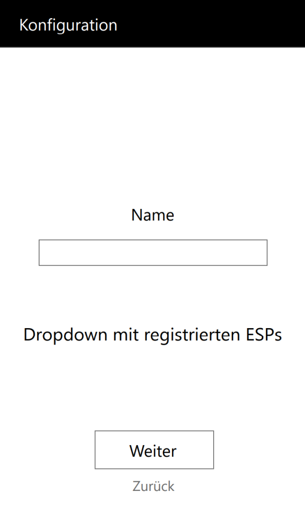
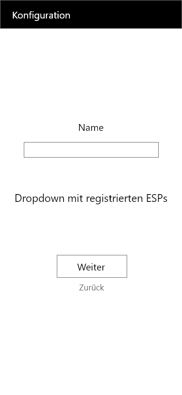
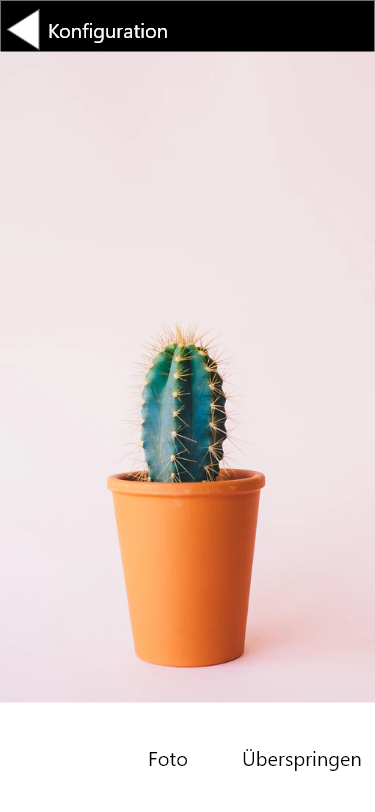
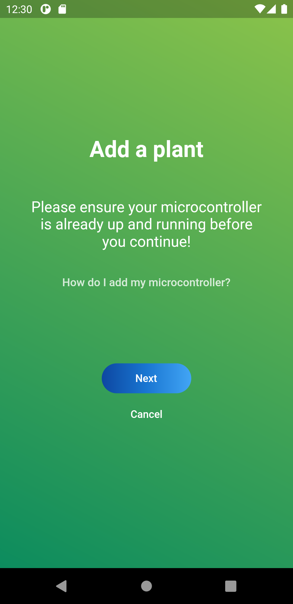
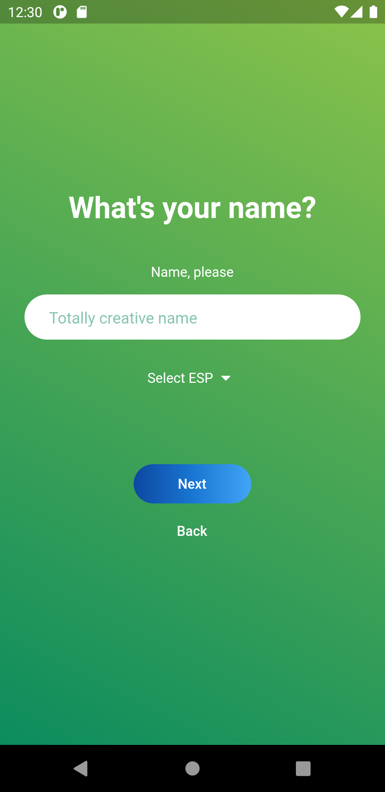
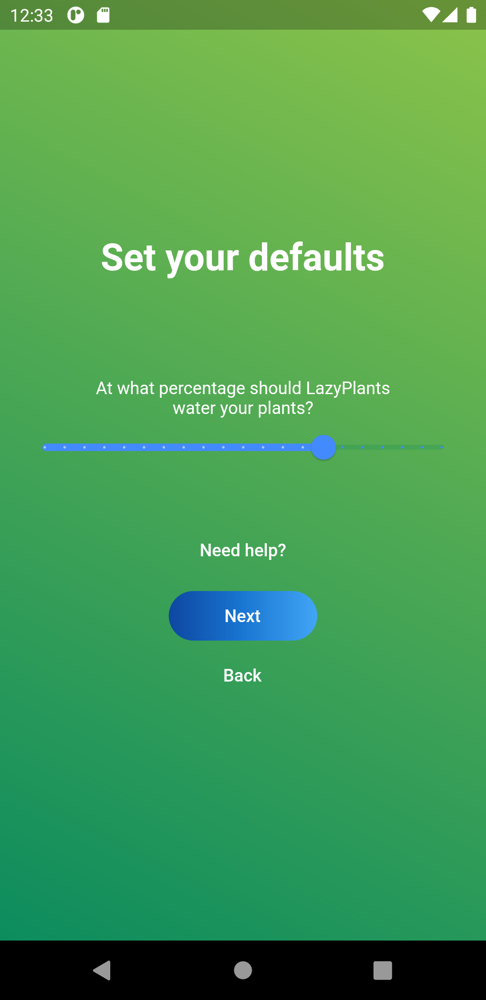
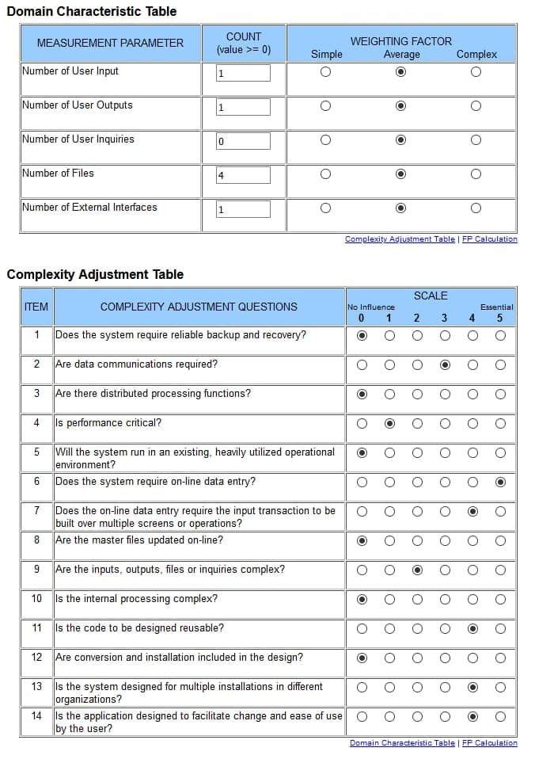

# Use-Case Specification: Add Plant

# 1. Add Plant

## 1.1 Brief Description
Every user can add their plants that they want to either get watered automatically or get a reminder to water them. First step is to register the ESP, after that the user needs to type in a name for it’s new plant. When adding the ESP and name happend, they can also insert a picture of the added plant.

## 1.2 Mockup

## 1.3 Screenshot

# 2. Flow of Events

## 2.1 Basic Flow

### Activity Diagram

### .feature File

[.feature file](/test_driver/features/add_plant.feature)  

## 2.2 Alternative Flows
n/a

# 3. Special Requirements
n/a

# 4. Preconditions
The main preconditions for this use case are:

 - The user started the app.
 - The user has an internet connection.
 - The user has to be logged in.

# 5. Postconditions

The main postconditions for this use case are:

 - The home page shows a new plant in the listview

# 6. Function Points

\
**FP: 51,52**