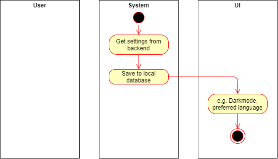

# Use-Case Specification: Sync Settings and Data

# 1. Sync Settings and Data 

## 1.1 Brief Description
Every user should be able to access his/her data on every supported device. Therefore settings data and plants data should be accessible via the backend. That's how we want to assure a seemless user experience.

## 1.2 Mockup
n/a

## 1.3 Screenshot
n/a

# 2. Flow of Events

## 2.1 Basic Flow

### Activity Diagram

## 2.2 Alternative Flows

# 3. Special Requirements
- login/logout-UC has to be implemented

# 4. Preconditions
The main preconditions for this use case are:

 - The user started the app.
 - The user has an internet connection.
 - The user has to be logged in.

# 5. Postconditions

The main postconditions for this use case are:

 - The user can use the app in his preferred language.
 - The app user e.g. Darkmode

# 6. Function Points

\
**FP: 28,88** 